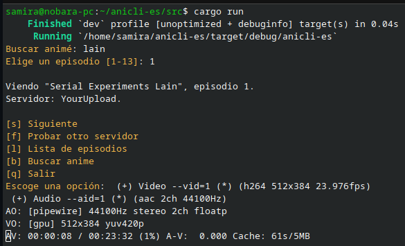

# anicli-es

Herramienta para ver animé desde la línea de comandos, con subtitulos en español; usa el sitio [animeflv](https://animeflv.net) para extraer los animes.

## Uso

	cargo run

## Dependencias

* MPV
